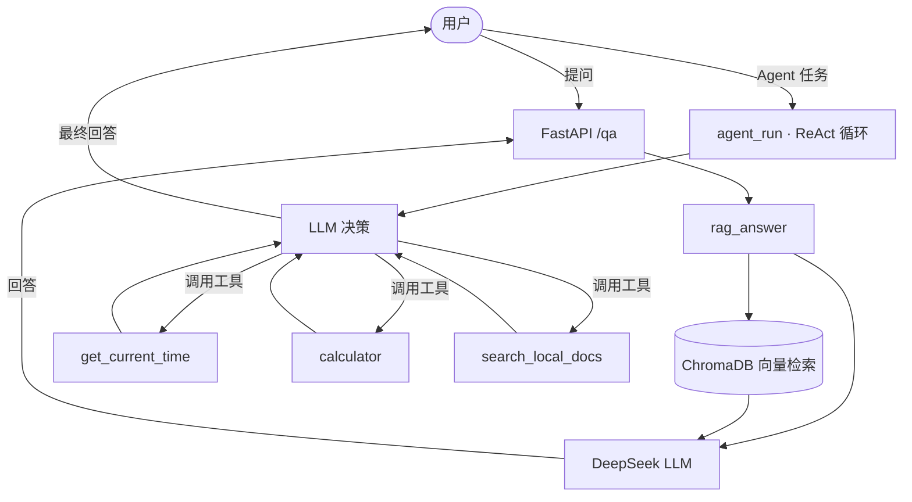

# my-ai-journey


> 零基础 → AI Agent：8 周暑假硬核学习路线项目。手写 ReAct Agent + RAG 知识库问答 + Prompt 工程评测，全程类型注解、pytest 测试、GitHub Actions CI 自动化。

## 学习路线总览

| 周 | 主题 | 核心产出 |
|---|---|---|
| 1 | Python 地基（变量→OOP→测试） | `basics.py` `function.py` `file_io.py` `oop_basics.py` `account_book` |
| 2 | 标准库 + HTTP + 代码规范 | `week2/`（CSV 清洗、日志分析、天气 API、SQLite）`pyproject.toml` |
| 3 | FastAPI + 异步 + 实战 | `fastapi_demo/`（含 CORS、批量请求） |
| 4 | LLM API + Prompt 工程 | `prompt_eng/`（chat / 结构化提取 / 评测 / 调参） |
| 5 | 手写 ReAct Agent | `agent/`（schemas / tool / agent_v1 / agent_v3） |
| 6 | Agent V3 + 多工具 + RAG 起步 | `agent/` 三工具调度、`doc_loader` `text_splitter` `embedder` |
| 7 | RAG 完整管线 + 测试 | `rag/`（vectordb / rag_v1 / experiment_report）、Docker |
| 8 | CI/CD + 部署 + 面试 | `.github/workflows/ci.yml`、ngrok 部署、`INTERVIEW.md` |

## 架构



## 目录结构

```
my-ai-journey/
├── .github/workflows/ci.yml   # GitHub Actions CI
├── src/
│   ├── agent/                 # 第5-6周：手写 ReAct V1-V3
│   │   ├── schemas.py         # 工具 Schema 标准化
│   │   ├── tool.py            # 工具实现 + call_tool
│   │   ├── agent_v1.py        # ReAct 循环（max_steps + 重试）
│   │   ├── agent_v3.py        # 三工具调度测试
│   │   ├── doc_loader.py      # 读 txt/pdf/docx
│   │   ├── text_splitter.py   # 三种切分 + overlap
│   │   └── embedder.py        # 字符袋向量（离线兜底）
│   ├── rag/                   # 第7周：RAG 问答
│   │   ├── vectordb.py        # ChromaDB 向量库
│   │   ├── rag_v1.py          # 检索 + 问答
│   │   └── experiment_report.py  # 调参实验
│   ├── prompt_eng/            # 第4周：LLM + Prompt
│   │   ├── chat_v1.py         # 第一个对话
│   │   ├── llm_utils.py       # tenacity 重试 + 流式
│   │   ├── info_extractor.py  # 结构化提取
│   │   └── eval_report.py     # 10 条测试集评测
│   ├── fastapi_demo/          # 第3周：FastAPI
│   ├── week2/                 # 第2周：标准库练习
│   ├── account_book/          # 第1周：OOP 项目
│   ├── main.py                # FastAPI 入口（/qa）
│   └── basics.py 等           # 第1周练习
├── tests/                     # pytest 全覆盖
├── data/                      # 本地文档（被 .gitignore 忽略）
├── docker-compose.yml
├── Dockerfile
├── pyproject.toml            # ruff / black / mypy 配置
├── requirements.txt
├── INTERVIEW.md               # 面试故事 + 手写伪代码
└── README.md
```

## 模块说明

### `src/agent/` — 手写 ReAct Agent
- **工具标准化**（`schemas.py`）：用 JSON Schema 定义工具
- **3 个工具**（`tool.py`）：`get_current_time` / `calculator` / `search_local_docs`
- **ReAct 循环**（`agent_v1.py`）：解析模型输出决定调工具还是直接回答，设 `max_steps` 防死循环，工具输出非法时 `__retry__` 重试
- **会话持久化**（`db.py`）：对话记录存 SQLite

### `src/rag/` — RAG 知识库问答
- **向量库**（`vectordb.py`）：ChromaDB 持久化
- **管线**（`rag_v1.py`）：检索 Top-K → 拼 Prompt → LLM 生成，带"资料没有就说不知道"的防幻觉约束
- **调参**（`experiment_report.py`）：对比 `chunk_size` / `top_k`

### `src/prompt_eng/` — Prompt 工程
- **结构化提取**（`info_extractor.py`）：杂乱文本 → `{"name","phone","address"}`
- **评测**（`eval_report.py`）：10 条测试集自动算准确率
- **健壮性**（`llm_utils.py`）：tenacity 重试 + 流式输出

## API 文档

服务入口为 `src/main.py` 的 FastAPI 应用，部署后默认端口 `8000`。

### `GET /qa`

知识库问答接口。

**请求参数**

| 参数 | 类型 | 说明 |
|---|---|---|
| `question` | string (query) | 用户问题 |

**示例请求**
```
GET /qa?question=年假有几天？
```

**示例响应**
```json
{
  "answer": "根据资料，年假为 5 天。"
}
```

**说明**
- 后端调用 `rag_answer()`：先从 ChromaDB 检索相关文档块，再交给 DeepSeek 生成答案
- 需要有效的 DeepSeek API Key（放在 `.env` 或通过环境变量注入）
- 资料库为空或检索不到时会回答"资料中未找到相关信息"

### 本地文档检索工具（Agent 内）
`search_local_docs(keyword)` 在 `data/` 目录的本地文档中按关键词检索，作为 Agent 的工具之一，不直接暴露为 HTTP 接口。

## 本地运行

```bash
pip install -r requirements.txt

# Agent 演示
python -m src.agent.agent_v3

# Prompt 评测
python -m src.prompt_eng.eval_report

# 跑测试
python -m pytest tests/ -q
```

> 调用真实 LLM 需要在项目根目录 `.env` 中配置：
> ```
> API_KEY=你的key
> ```
> 测试中用 monkeypatch / mock 隔离了真实 API 调用，无 key 也能跑 CI。

## Docker 部署

```bash
docker compose up -d --build
# 访问 http://localhost:8000/qa?question=你的问题
```

容器通过环境变量注入 API Key（建议配合 `.env` 或 `SILICONFLOW_KEY`）。

## CI/CD

每次 push / PR 自动触发 GitHub Actions（`ci.yml`）：
1. `pip install -r requirements.txt`
2. `ruff check` 代码规范检查
3. `pytest` 运行测试（忽略需要真实 API Key 的 `test_rag.py`）

点击顶部徽章可查看实时状态。

## 面试准备

见 [`INTERVIEW.md`](./INTERVIEW.md)：3 个项目故事（Agent / RAG / Prompt 工程）+ 手写 Agent 伪代码 + 模拟面试要点。

## 备注

- `embedder.py` 使用字符袋向量作为离线兜底，生产环境建议替换为真实 Embedding API
- pytest 真 API 测试需要 `.env` 里有效 DeepSeek Key
